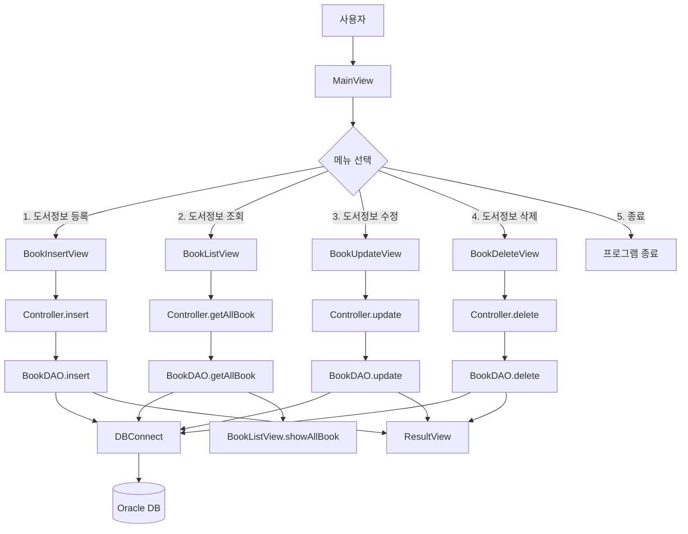
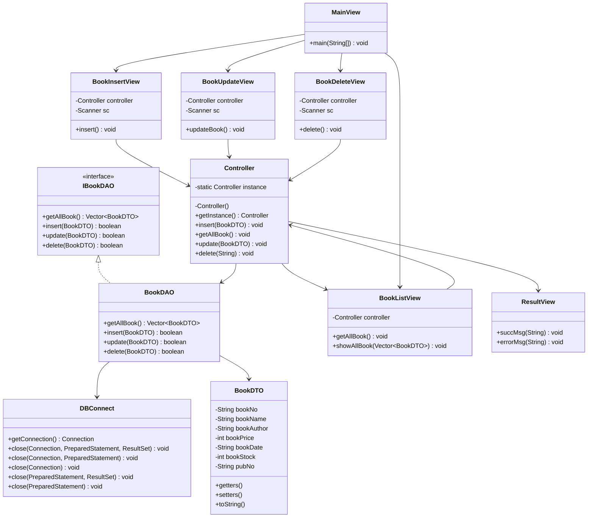

# 2025-08-18 (월)

## Java 프로젝트 - JavaProjectEx

JavaProjectEx는 Java와 JDBC를 활용한 도서 관리 프로그램으로, MVC 패턴을 적용하여 구현한 콘솔 애플리케이션입니다. 이 프로젝트는 도서 정보의 등록, 조회, 수정, 삭제 기능을 제공하며, 데이터베이스와의 연동을 통해 정보를 영구적으로 저장합니다.

### 프로젝트 구조

프로젝트는 MVC(Model-View-Controller) 아키텍처 패턴을 따르며 각 계층이 명확하게 분리되어 있습니다. 전체 구조는 다음과 같습니다:

```
src/
├── controller/
│   └── Controller.java
├── model/
│   ├── BookDAO.java
│   ├── BookDTO.java
│   └── IBookDAO.java
├── util/
│   └── DBConnect.java
└── view/
    ├── BookDeleteView.java
    ├── BookInsertView.java
    ├── BookListView.java
    ├── BookUpdateView.java
    ├── MainView.java
    └── ResultView.java
```

### MVC 패턴 분석

#### Model

- **BookDTO**: 도서 정보를 담는 Data Transfer Object로, 도서번호, 도서명, 저자, 가격, 발행일, 재고, 출판사번호 등의 속성을 가짐
- **IBookDAO**: 데이터 접근 인터페이스로, CRUD 기능을 정의
- **BookDAO**: IBookDAO 인터페이스를 구현하여 실제 데이터베이스 작업 수행

#### View

- **MainView**: 메인 메뉴를 표시하고 사용자 입력을 처리
- **BookInsertView**: 도서 정보 등록 화면
- **BookListView**: 도서 정보 조회 화면
- **BookUpdateView**: 도서 정보 수정 화면
- **BookDeleteView**: 도서 정보 삭제 화면
- **ResultView**: 작업 결과 메시지 표시

#### Controller

- **Controller**: View와 Model 사이의 중재자 역할, 싱글톤 패턴으로 구현되어 단일 인스턴스만 생성

### 디자인 패턴 분석

#### 1. DAO/DTO 패턴

- **DTO(Data Transfer Object)**: BookDTO 클래스는 데이터 전송 객체로 도서 정보를 캡슐화
- **DAO(Data Access Object)**: BookDAO 클래스는 데이터베이스 접근 로직을 캡슐화하여 비즈니스 로직과 분리

#### 2. 싱글톤 패턴

- **Controller 클래스**에서 싱글톤 패턴을 적용하여 단일 인스턴스만 생성
- 여러 View에서 동일한 Controller 인스턴스를 공유하여 DB 접근 통로를 일원화
- 구현 방식:
  ```java
  private static Controller instance = new Controller();
  private Controller() { } // private 생성자
  public static Controller getInstance() {
    return instance;
  }
  ```

#### 3. 인터페이스 기반 설계

- IBookDAO 인터페이스를 통해 데이터 접근 계층을 추상화
- 구현체(BookDAO)와 인터페이스를 분리하여 유연성 확보

### JDBC 연결 및 예외처리

#### 1. JDBC 연결 관리

- **DBConnect 클래스**에서 데이터베이스 연결 및 자원 반환 로직 캡슐화
- 메소드 오버로딩을 통해 다양한 자원 반환 시나리오 처리
  - Connection, PreparedStatement, ResultSet 조합별 close() 메소드 제공

#### 2. 예외처리 방식

- DAO 계층에서 발생한 예외를 Controller로 전파(throw)
- Controller에서 try-catch 블록으로 예외를 잡아 적절한 사용자 메시지 표시
- ResultView 클래스를 통해 성공/실패 메시지 일관되게 표시

### 주요 기능

1. **도서 정보 등록**: 도서번호, 제목, 가격, 발행일, 출판사번호 입력 후 DB에 저장
2. **도서 정보 조회**: DB에서 모든 도서 정보를 조회하여 표시
3. **도서 정보 수정**: 도서번호로 기존 도서 정보를 수정
4. **도서 정보 삭제**: 도서번호로 도서 정보를 삭제

### 프로그램 실행 흐름

아래 다이어그램은 프로그램의 전체적인 실행 흐름을 보여줍니다:



### 클래스 다이어그램

아래 다이어그램은 프로젝트의 클래스 구조와 관계를 보여줍니다:



### 구현 예제

#### 1. 싱글톤 패턴 구현 (Controller.java)
```java
public class Controller {
  // 본인 객체 인스턴스를 본인이 제공 - private static으로 객체 구성
  private static Controller instance = new Controller();

  private Controller() {
    //new 연산자로 생성자 호출 불가능하게 막음
  }

  //외부호출가능 클래스명으로 바로 호출 가능
  public static Controller getInstance() {
    return instance; //호출되면 공유 instance의 참조값을 반환
  }
}
```

#### 2. DAO 인터페이스 정의 (IBookDAO.java)
```java
public interface IBookDAO {
  public Vector<BookDTO> getAllBook() throws Exception; //전체 도서 정보 조회
  public boolean insert(BookDTO dto) throws Exception;
  public boolean update(BookDTO dto) throws Exception;
  public boolean delete(BookDTO dto) throws Exception;
}
```

#### 3. 데이터베이스 연결 및 자원 관리 (DBConnect.java)
```java
public static Connection getConnection() {
  Connection con = null;
  
  try {
    String url = "jdbc:oracle:thin:@localhost:1521:xe";
    String user = "SQL_USER"; //book table 사용
    String pwd = "1234";
    
    con = DriverManager.getConnection(url,user,pwd);
    
    if(con != null) {
      System.out.println("DB연결 성공!");
    }else {
      System.out.println("DB연결 실패!");
    }
  }catch(Exception e) {
    e.printStackTrace();
  }
  return con;    
}
```

#### 4. 예외 처리 및 전파 (BookDAO.java)
```java
@Override
public boolean insert(BookDTO dto) throws Exception {
  //한권 도서 정보 저장
  Connection con = null;
  PreparedStatement pstmt = null;
  try {
    con = DBConnect.getConnection();
    pstmt = con.prepareStatement(
        "insert into book values(?, ?, ?, ?, ?)"
    );
    pstmt.setString(1, dto.getBookNo());
    pstmt.setString(2, dto.getBookName());
    pstmt.setInt(3, dto.getBookPrice());
    pstmt.setString(4, dto.getBookDate());
    pstmt.setString(5, dto.getPubNo());

    int result = pstmt.executeUpdate();
    if (result == 0) {
      return false;
    }
  } catch (Exception e) {
    throw e; //호출한 쪽에서 예외처리하도록 예외를 인위적으로 발생 전달
  } finally {
    DBConnect.close(con);
  }
  return true;
}
```

### 학습 포인트

1. **MVC 패턴**: 사용자 인터페이스와 비즈니스 로직, 데이터 접근 계층을 분리하여 유지보수성 향상
2. **싱글톤 패턴**: 단일 인스턴스만 생성하여 자원 관리 효율화
3. **DAO/DTO 패턴**: 데이터 접근 로직과 데이터 전송 객체를 분리하여 코드 재사용성 향상
4. **인터페이스 기반 설계**: 구현체와 인터페이스 분리로 유연성 확보
5. **JDBC 활용**: 데이터베이스 연결 및 쿼리 실행, 자원 관리
6. **예외처리**: 계층별 예외 전파 및 처리 방식
7. **자원 관리**: try-catch-finally 블록을 통한 안전한 자원 반환
